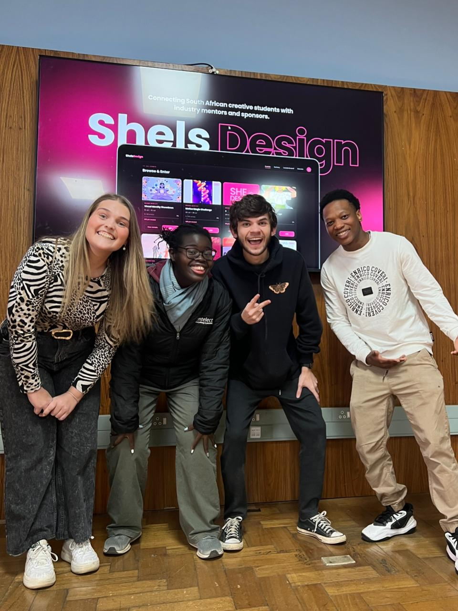

- - - -

# SheIsDesign

> **A community platform celebrating, challenging, and elevating female students in design.**  
> Built with React · Powered by a dark, accessible design system · Crafted with intention.

---

## Overview

ShelsDesign is a full-stack web platform designed to support and celebrate female design students across South Africa. The platform enables administrators to manage events, participants, leaderboards, galleries, and donations — all through a cohesive, dark-mode admin interface built to WCAG AA accessibility standards.

The public-facing side allows students and industry professionals to register, enter competitions, submit work, and track their progress on a leaderboard.

---

## Tech Stack 

| Layer               | Technology             | Purpose                                     |
| ------------------- | ---------------------- | ------------------------------------------- |
| **Frontend**        | React (CRA) + DaisyUI  | SPA UI, responsive layout, components       |
| **Backend**         | .Net                   | Contexts, Models, Controllers and DTOs      |
| **Testing**         | Jest + xUnit +         | TDD - Unit, Integration and Component       |
| **Database**        | PostgreSQL (Aiven)     | Relational data for ERD Schemas             |
| **HTTP Client**     | Axios                  | Frontend ↔ backend requests                 |
| **Deployment**      | Render (backend)       | CI/CD and hosting                           |
| **Packaging**       | Electron               | For creating a desktop app                  |
| **Version Control** | GitHub                 | To manage developer commits and branches    |

---

## UI & Brand Style

### Style summary*

- **The Client’s Vision**: The client explicitly requested a pink-centric colour scheme paired with the modern Poppins typeface. The core design challenge was honouring this specific palette while ensuring the platform remained sophisticated, highly accessible, and appealing to a broad demographic of design students.
- **Colour Palette (Dark Mode Elegance)**: Inspired by the neon fluid energy of our moodboard, we anchored the vibrant pinks against a deep, premium dark-mode canvas. The system uses a bold Primary Magenta (#C41262) and Tertiary Pink (#FE40B1) for impactful highlights, balanced by soft, muted neutrals (#DBC1C6 and #FBEBED) for backgrounds, and an ultra-dark charcoal (#201A1B) for text contrast, comfortably meeting WCAG AA standards.
- **Typography**: Fully committed to the Poppins typeface, using a strict hierarchical scale stretching from bold, statement headings (H1 at 32px, Weight 700) down to highly readable platform interface body text (13–14px, Weight 400, 1.6 line-height) to maintain clean, geometric layout pacing.
- **Layout & Components**: Designed around a responsive 12-column grid system built for desktop and Electron breakpoints. Components feature smooth, intentional micro-interactions, distinct state chips (Active, Pending, Rejected), and soft, rounded container geometry (with border radii ranging from 8px to 16px) to give the application an approachable yet clean, modular aesthetic.

### Moodboard


---
## Key Features
### Role-based Dashboards
- **Admin Interface**: A cohesive, control centre designed for platform administrators to seamlessly manage real-time events, participants, galleries, and the leaderboard.
- **Judge Scoring System**: A dedicated portal featuring a custom, task-oriented user flow and backend scoring logic built specifically to allow judges to review and evaluate student work cleanly.

### Gamification & Engangement
- **Live Competition Leaderboard**: A gamified, real-time student tracking system that calculates competition points and renders live rankings based on system-validated judge scores.
- **Serverless Transactional Messaging**: Integration of an asynchronous, frontend-driven email client via EmailJS, eliminating backend SMTP server configuration overhead while ensuring fast user messaging pipelines.

### Donations System
A smart donation feature that automatically distributes incoming financial support across three core platform pillars to guarantee maximum impact:
- **Events & Competitions**: Funds the prize pools, logistics, and execution of active design challenges.
- **Student Resources**: Supplies academic materials, software access, and learning tools for design students.
- **Community Workshops**: Powers regional training sessions, guest lectures, and collaborative design masterclasses.

---

## Getting started

### Prerequisites

- React `>= 19.2.4.x`
- .Net `>= 10.x`

### Backend

```bash
# Clone the repository
git clone https://github.com/your-org/sheisdesign.git
cd backend

# Start the backend
dotnet run
```

### Frontend

```bash
# New Terminal
cd frontend

# Install dependencies
npm install

# Start the development server
npm start
```

The app will open at [http://localhost:3000](http://localhost:3000).

---

## 🛢 Database Schema (ERD Summary)
The database schema, as illustrated in the ERD below, is engineered to support a highly relational, scalable, and secure platform. The architecture centres around managing core entities such as Users, Students, Events, and community interactions (Posts, Comments, Submissions, and Donations).

#### Key Architectural Standards
- **3rd Normal Form (3NF) Compliance**: The database has been carefully normalized to the 3rd level of normalization (3NF). This eliminates data redundancy, prevents update anomalies, and ensures that all non-key attributes are fully dependent solely on the primary keys.
- **No Many-to-Many Relationships**: To maximise data integrity and optimise query performance, direct many-to-many relationships were intentionally avoided. Any complex relationships are resolved cleanly via one-to-many logical constraints and specialised relational mapping (such as separating general User credentials from specific Student profiles or mapping Donation records directly to individual Event targets).

#### Core Entities & Relationships
- **User & Student**: Handles authentication and role-based access control. A base User record maps directly to a detailed Student profile containing university and academic tracking metrics.
- **Event & Donation**: Tracks platform events alongside financial support. The Donation table links directly to a specific EventID, ensuring transparent financial allocation.
- **Post & Comment**: Drives community interaction. Post entities tie back to specific events, while the Comment table acts as a relational bridge connecting comments directly to the User who authored them.
- **Submission**: Manages competition entries, work status, points, and leaderboard ranks linked directly to an individual StudentID.

br 


---

## Deployment Process

#### Backend (.Net + C#):
Deployed on **Render**.  
Responsible for handling data requests, authentication, and database communication.

#### Database (PostgreSQL):
Hosted on **Aiven**, allowing remote access through phpMyAdmin.  
Credentials are stored in appsettings.json in the backend and are git-ignored.

---

##  Reflection
Building SheIsDesign was a transformative journey that pushed our team to evolve from individual developers into a cohesive, full-stack engineering team. Navigating the integration of a React frontend packaged with Electron, a .NET backend, and a 3NF-compliant PostgreSQL database required immense technical adaptability and precision. Overcoming critical roadblocks—such as configuring secure Google Cloud permissions, managing complex component-based states, establishing isolated unit-testing frameworks with mock services, and executing fluid database migrations—forced us to adopt rigorous debugging and optimisation standards. This process significantly sharpened our understanding of server-client architecture, serverless data pipelines, and strict data contracts, transforming major technical hurdles into deep learning experiences.

Beyond the technical architecture, this project was a masterclass in cross-functional collaboration and user-centric design. We successfully balanced highly technical administrative requirements—like designing task-oriented workflows for Admin and Judge dashboards—with strict accessibility and visual identity goals, building lightweight, library-free CSS animations that perform beautifully. When individual bottlenecks arose in testing or UI modularity, we leveraged internal peer mentoring and agile prototyping to keep the team unblocked. Ultimately, SheIsDesign stands as a testament to our team's shared resilience, proving that intentional, high-fidelity community platforms are built at the intersection of clean engineering and collaborative problem-solving.

###  Proud Moments
- **Keagan**: Engineered a robust frontend functions library that abstracted complex API interactions into clean, reusable data-fetching pipelines, strictly maintaining a separation of concerns and alleviating backend workloads. Additionally, partnered closely with **Gaby** throughout the system development life cycle (SDLC) to bridge frontend requirements and backend logic, successfully implementing state management, business rules, and UI layouts for the intricate Judge scoring system and real-time event management features.
- **Anika**: Brought the SheIsDesign visual brand to life by authoring custom, fluid, floating orb animations that run across key landing sections. By building these directly with vanilla CSS keyframes and JSX, a high-fidelity visual aesthetic was achieved with zero external library overhead, keeping the application bundle lightweight, performant, and optimised for load speed.
- **Gaby**: Modernised the platform's communication flow by integrating EmailJS to handle automated user messaging directly from the frontend UI, eliminating the need to configure a traditional backend SMTP server while minimising infrastructure complexity. Furthermore, successfully designed and implemented the structural layouts for both the Admin and Judge dashboards, creating a highly logical, task-oriented user flow that aligned perfectly with the client’s administrative needs.
- **Keabetswe (KB)**: Architected the entire database access layer from the ground up by building out all relational Models, API Controllers, Data Transfer Objects (DTOs), and DbContext handlers before successfully hosting the production PostgreSQL instance on Aiven. Additionally, co-authored and optimised critical backend utility methods within the common frontend functions library to establish clean, reliable data contracts across the stack.

### Challenges & Solutions

**Keagan**
- **Challenges**: Struggled with negotiating Google Cloud services and navigating organisational permissions, which delayed implementing Google Login. Also faced difficulties setting up a frontend unit testing framework independent of backend availability.
- **Solutions**: Utilised mock services to isolate and test frontend features individually without relying on live backend endpoints.

**Anika**
- **Challenges**: Diagnosing a post-submission error that required tracing the mismatch between frontend data and backend expectations. Managing CSS conflicts as the project grew, with modal styles bleeding into page-level stylesheets. Balancing the overall design and feel of the website, as the brief required a pink colour scheme, while still needing to attract a wide audience of young students.
- **Solutions**: Fixed the submission error by correcting the data sent from the frontend form. Scoped modal CSS using a dedicated file and ptl- class prefix to prevent style conflicts. Built fully animated visuals, including floating orbs, rotating shapes and pulsing rings, directly in JSX with no external dependencies, replacing all image placeholders across the Support and CTA sections.

**Gaby**
- **Challenges**: Struggled with shifting from monolithic frontend structures to true component-based development, ensuring modularity and reusability across the application. Additionally, faced architectural roadblocks when deciding how to structure and separate the distinct user flows for the Admin and Judge dashboards/portals. Testing also proved to be a major hurdle due to the complexity of the integrated features.
- **Solutions**: Actively collaborated with **Anika** to deepen my understanding of component-based development, successfully implementing a clean component architecture. To resolve the dashboard dilemma, I utilised an agile, iterative approach—diving into rapid prototyping to see what worked visually and functionally, while continuously consulting the team for design alignment. When testing stalled, I paired up with **Keabetswe** (KB) to troubleshoot and successfully implement the required test suites.

**KB**
- **Challenges**: The challenges that this project has produced, at least the ones discovered by me, were the database structure changes. Since the database structure is permanent, it is not easy to change. Unit Testing has also been a difficult part of development due to the sheer number of tests required in a large codebase and the many components that need to be tested.
- **Solutions**: My Solution to the database issue was to attempt to manipulate the migrations feature to undo the structures and redo them with a few commands from the command line. This has been my method of improvisation. Furthermore, a unit testing library was used to assess how much of the codebase had been unit tested, determine how much more testing was needed, and ensure that close communication with my teammates was crucial for this part to avoid conflicts and work efficiently.

---

## Demo Video

[Watch Demo Video](https://drive.google.com/file/d/1Vuk0S-6KSA4xeNBTiyUunoKhHjJYpbML/view?usp=sharing)


## Final Presentation Slide Show

[View Presentation](https://www.figma.com/slides/FDR25zYjXFTsmbLN681JkI)

---

## Contributing

1. Fork the repository
2. Create a feature branch: `git checkout -b feature/your-feature-name`
3. Commit your changes: `git commit -m "feat: add your feature"`
4. Push to the branch: `git push origin feature/your-feature-name`
5. Open a Pull Request

### Commit Convention

This project follows [Conventional Commits](https://www.conventionalcommits.org/):

```
feat:     New feature
fix:      Bug fix
style:    Visual/styling changes (no logic change)
refactor: Code restructure
docs:     Documentation only
chore:    Build, config, tooling
```

---

## Authors

<a href="https://github.com/GabyNor05/SheIsDesign/graphs/contributors">
  
</a>

Made with [contrib.rocks](https://contrib.rocks).

#### Trello
[Check out Trello board](https://trello.com/b/P1MS94fg/dv300-semester-1)

---

## License

Distributed under the MIT License. See `LICENSE` for more information.

---

<div align="center">

**SheIs**Design &nbsp;·&nbsp; Built with 🤍 in South Africa &nbsp;·&nbsp; DV300 · 2026

</div>
