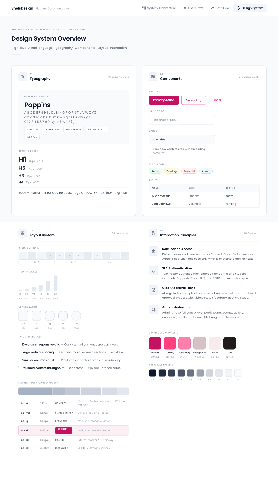
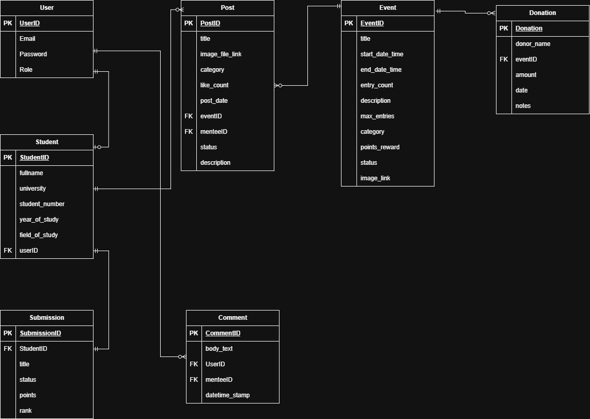

- - - -

# SheIsDesign

> **A community platform celebrating, challenging, and elevating female students in design.**  
> Built with React · Powered by a dark, accessible design system · Crafted with intention.


## Table of Contents

- [Overview](#overview)
- [Tech Stack](#tech-stack)
- [UI & Brand Style](#ui-&-brand-style)
- [Key Features](#key-features)
- [Getting Started](#getting-started)
- [Database Schema (ERD Summary)](#database-schema-erd-summary)
- [Deployment Process](#deployement-process)
- [Reflection](#reflection)
- [Demo & Promo Videos](#demo-&-promo-videos)
- [Mockups](#mockups)
- [Final Presentation Slide Show](#final-presentation-slide-show)
- [Contributing](#contributing)
- [Authors](#authors)
- [License](#license)

---

## 🔎 Overview

ShelsDesign is a full-stack web platform designed to support and celebrate female design students across South Africa. The platform enables administrators to manage events, participants, leaderboards, galleries, and donations — all through a cohesive, dark-mode admin interface built to WCAG AA accessibility standards.

The public-facing side allows students and industry professionals to register, enter competitions, submit work, and track their progress on a leaderboard.

---

## 🏗️ Tech Stack 

| Layer               | Technology             | Purpose                                     |
| ------------------- | ---------------------- | ------------------------------------------- |
| **Frontend**        | React (CRA) + DaisyUI  | SPA UI, responsive layout, components       |
| **Backend**         | .Net                   | ---                                         |
| **Testing**         | Jest + xUnit +         | TDD - Unit, Integration and Component       |
| **Database**        | PostgreSQL (Aiven)     | Relational data for ERD Schemas             |
| **HTTP Client**     | Axios                  | Frontend ↔ backend requests                 |
| **Deployment**      | Render (backend)       | CI/CD and hosting                           |
| **Packaging**       | Electron               | For creating a desktop app                  |
| **Version Control** | GitHub                 | ---                                         |

---

## 🎨 UI & Brand Style

**Style summary**

- Palette: calming teals/greens for trust & growth.
- Typography: modern, accessible (system fonts or Inter/Poppins).
- Components: rounded cards, soft shadows, clear CTAs.
- Illustration: friendly tutoring scenes, subtle texture background.

**Style Tile**



---
## 💡 Key Features
- 

---

## ⚙️ Getting started

### Prerequisites

- React `>= 19.2.4.x`
- .Net `>= 10.x`

### Backend

```bash
# Clone the repository
git clone https://github.com/your-org/sheisdesign.git
cd backend

# Start the backend
dotnet run
```

### Frontend

```bash
# New Terminal
cd frontend

# Install dependencies
npm install

# Start the development server
npm start
```

The app will open at [http://localhost:3000](http://localhost:3000).

---

## 🛢 Database Schema (ERD Summary)
The database schema, as illustrated in the ERD below, is engineered to support a highly relational, scalable, and secure platform. The architecture centres around managing core entities such as Users, Students, Events, and community interactions (Posts, Comments, Submissions, and Donations).

#### Key Architectural Standards
- **3rd Normal Form (3NF) Compliance**: The database has been carefully normalized to the 3rd level of normalization (3NF). This eliminates data redundancy, prevents update anomalies, and ensures that all non-key attributes are fully dependent solely on the primary keys.
- **No Many-to-Many Relationships**: To maximise data integrity and optimise query performance, direct many-to-many relationships were intentionally avoided. Any complex relationships are resolved cleanly via one-to-many logical constraints and specialised relational mapping (such as separating general User credentials from specific Student profiles or mapping Donation records directly to individual Event targets).

#### Core Entities & Relationships
- **User & Student**: Handles authentication and role-based access control. A base User record maps directly to a detailed Student profile containing university and academic tracking metrics.
- **Event & Donation**: Tracks platform events alongside financial support. The Donation table links directly to a specific EventID, ensuring transparent financial allocation.
- **Post & Comment**: Drives community interaction. Post entities tie back to specific events, while the Comment table acts as a relational bridge connecting comments directly to the User who authored them.
- **Submission**: Manages competition entries, work status, points, and leaderboard ranks linked directly to an individual StudentID.



---

## 🚀 Deployment Process

#### Backend (.Net + C#):
Deployed on **Render**.  
Responsible for handling data requests, authentication, and database communication.

#### Database (PostgreSQL):
Hosted on **Aiven**, allowing remote access through phpMyAdmin.  
Credentials are stored in appsettings.json in the backend and are git-ignored.

---

## 🧭 Reflection
This project was a full journey for me, not just in building a product, but in learning how to think like a full-stack developer. One of the biggest learning curves was setting up and maintaining the SQL database and ensuring secure communication between the frontend and backend. I also had to learn how to deploy both sides of the app separately, which required research, patience, and LOTS of trial-and-error. Through this, I really improved my debugging skills, my understanding of server-client communication, and how to optimise code for performance and loading speed.


### 👏 Proud Moments
- Built a full-stack application independently.
- Successfully integrated database + backend + frontend deployments.
- Created a platform that reflects real tutor needs.

### 🧪 Challenges & Solutions
One major challenge was deployment, managing the frontend, backend, and SQL database across different platforms. I solved this by hosting the backend on Render, the SQL database on AlwaysData, and using environment variables to securely connect everything. I also ran into CORS issues when the frontend tried to call the backend. I resolved those by configuring allowed origins and carefully using environment variables. Finally, I do not think I optimised performance by compressing images, using lazy loading for tutor images, and reducing unused CSS, like I should have.

**Keagan Boucher**
- **Challenges**: Struggled with negotiating Google Cloud services and navigating organisational permissions, which delayed implementing Google Login. Also faced difficulties setting up a frontend unit testing framework independent of backend availability.
- **Solutions**: Utilised mock services to isolate and test frontend features individually without relying on live backend endpoints.

**Anika de Beer**
- **Challenges**:
- **Solutions**: 

**Gaby Norris**
- **Challenges**:
- **Solutions**: 

**Keabetswe Olifant**
- **Challenges**: The challenges that this project has produced, at least the ones discovered by me, were the database structure changes. Since the database structure is permanent, it is not easy to change. Unit Testing has also been a hard part of development due to the sheer number of tests required by a large code base and the many parts that need testing.
- **Solutions**: My Solution to the database issue was to attempt to manipulate the migrations feature to undo the structures and redo them with a few commands from the command line. This has been my method of improvisation. Furthermore, a unit testing library was used to assess how much of the codebase had been unit tested, determine how much more testing was needed, and ensure that close communication with my teammates was crucial for this part to avoid conflicts and work efficiently.

---

## 📽️ Demo & Promo Videos

[Watch Demo Video]()
[Watch Demo Video]()

## 🖼️ Mockups


## 👩‍🏫 Final Presentation Slide Show

[View Presentation]()

---

## 🤝 Contributing

1. Fork the repository
2. Create a feature branch: `git checkout -b feature/your-feature-name`
3. Commit your changes: `git commit -m "feat: add your feature"`
4. Push to the branch: `git push origin feature/your-feature-name`
5. Open a Pull Request

### Commit Convention

This project follows [Conventional Commits](https://www.conventionalcommits.org/):

```
feat:     New feature
fix:      Bug fix
style:    Visual/styling changes (no logic change)
refactor: Code restructure
docs:     Documentation only
chore:    Build, config, tooling
```

---

## 👩‍💻 Authors

<a href="https://github.com/GabyNor05/SheIsDesign/graphs/contributors">
  
</a>

Made with [contrib.rocks](https://contrib.rocks).

#### Trello
[Check out Trello board](https://trello.com/b/P1MS94fg/dv300-semester-1)

---

## ⚖️ License

Distributed under the MIT License. See `LICENSE` for more information.

---

<div align="center">

**SheIs**Design &nbsp;·&nbsp; Built with 🤍 in South Africa &nbsp;·&nbsp; DV300 · 2025

</div>
